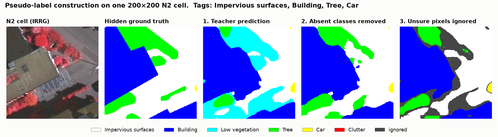
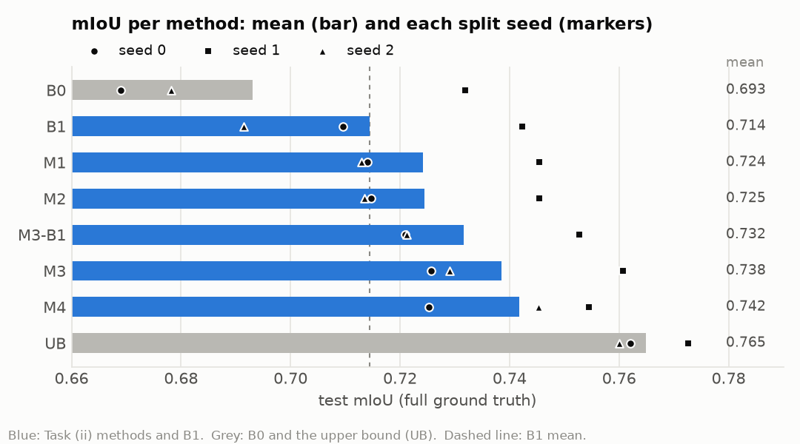
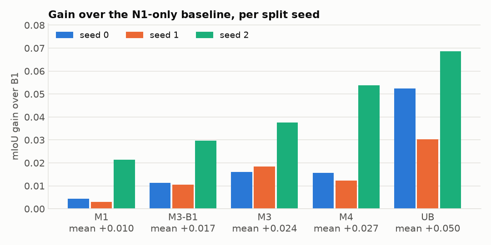
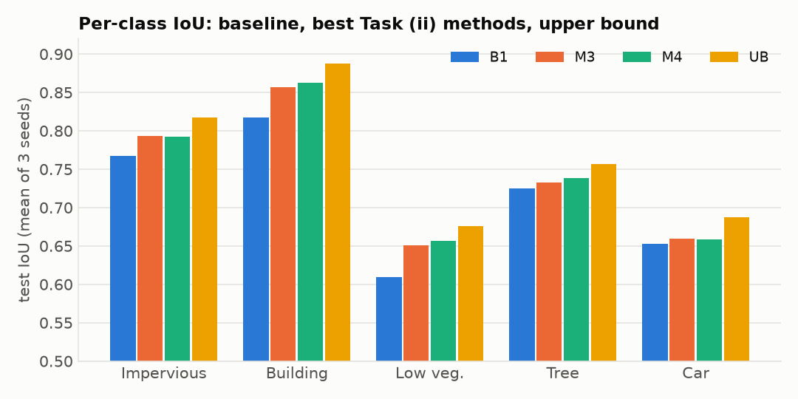
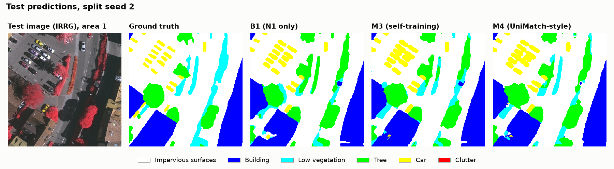

# Weakly semi-supervised segmentation

### Problem description

Pixel-level labels are expensive, but image-level class labels are much cheaper and more
plentiful. The goal is to use these cheap labels to improve accuracy on the pixel-level task.

Semantic segmentation of the ISPRS **Vaihingen** dataset: 33 aerial IRRG orthophotos
(about 1900×2500 px at 9 cm) with 6 classes:

1. Impervious surfaces - WHITE
2. Building - BLUE
3. Low vegetation - TURQUOISE
4. Tree - GREEN
5. Car - YELLOW
6. Clutter/background - RED (predicted, but excluded from tags and metrics)

Split (3 random split seeds, `wsss.data.split_data`):

* N1 = 3 images with pixel-level labels (10%)
* N2 = 23 images with **crop-level tags** only (70%): each 200×200 cell of a fixed grid is
  tagged with the classes it contains
* Test = 7 images (20%)

Tasks:

* Task (i): N1 pixel-level labels only
* Task (ii): N1 pixel-level labels + N2 crop-level tags

### Methods

| ID | Data | Method | Config |
|---|---|---|---|
| B0 | N1 | Original EncDecUnpool (VGG16-BN SegNet/DeconvNet-like), fixed | `configs/b0_encdec_unpool.yaml` |
| B1 | N1 | U-Net, ImageNet ResNet-50, CE + Dice, car-aware crop sampling | `configs/b1_unet_r50.yaml` |
| M1 | N1 + N2 tags | B1 + multi-label loss on LSE-pooled softmax probabilities of each tagged crop | `configs/m1_tags_unet_r50.yaml` |
| M2 | N1 + N2 tags | M1 + prediction filtering at inference (Bae et al. 2022) | M1 run, `test_filtered` |
| M3 | N1 + N2 tags | Offline self-training: M1 teacher pseudo-labels N2, restricted to each crop's tags, thresholded; then fine-tuning on N1 | `configs/m3_self_train_unet_r50.yaml` |
| M3-B1 | N1 + N2 tags | As M3, but the teacher is B1 (N1 only): the original Task (ii) idea | `configs/m3_b1_teacher_unet_r50.yaml` |
| M4 | N1 + N2 tags | UniMatch-style weak-to-strong consistency (2 strong views + feature perturbation) with tag-constrained pseudo-labels + tag loss | `configs/m4_unimatch_unet_r50.yaml` |
| UB | N1 + N2 pixels | Upper bound: B1 with the N2 ground truth revealed | `configs/ub_unet_r50.yaml` |

### Solutions implemented

All models output 6 classes. Clutter is predicted but excluded from the tags and the metrics.

**How the crop-level labels are simulated.** Every N2 image is cut into a fixed, non-overlapping
grid of 200×200 cells (edge cells are smaller). Each cell gets a 5-class tag vector, computed
once from the hidden ground truth: a class is present if at least one pixel of it is in the
cell, as in v0.1. After that, the N2 pixel labels are never used for training. Tags are not
recomputed on random crops, which would leak finer location information.

**B0 – original network, fixed.** The v0.1 EncDecUnpool network (VGG16-BN encoder, SegNet-style
decoder using the pooling indices, dropout in the decoder), trained on N1 only. Two fixes:
* the ImageNet weights are mapped layer by layer and every encoder tensor is checked; in v0.1
  only the first convolution was loaded correctly;
* BatchNorm now sits between convolution and ReLU, as in VGG16-BN.

The encoder is trained at half the learning rate.

**B1 – modern supervised baseline.** U-Net with an ImageNet ResNet-50 encoder
(`segmentation_models_pytorch`), trained on N1 only. Training uses:
* 256 px random crops with the 8 flip/rotation transforms;
* car-aware sampling: 30% of the crops are centred on a car;
* cross-entropy with median-frequency class weights, plus Dice loss;
* AdamW with a poly schedule, mixed precision, 10k iterations.

**M1 – tag loss.** B1 plus N2 cells in every batch. The network's per-pixel class probabilities
in each cell are pooled with Log-Sum-Exp pooling (between average and max pooling) into one
presence score per class. The scores are trained against the tags with binary cross-entropy.
An absent class must then have low probability everywhere in the cell; a present one must be
confident somewhere.

**M2 – prediction filtering** (Bae et al. 2022). At test time no tags exist. The pooled
presence scores of the M1 model are computed on 200 px cells, and classes scoring below 0.5 are
suppressed.

**M3 – offline self-training with corrected masks.** This is the Task (ii) idea of v0.1:
1. A teacher predicts every N2 image (sliding window).
2. In each cell, classes absent from the tags are removed from the prediction, and their
   probability goes to the classes that are present.
3. Pixels below a confidence threshold (0.9; 0.7 for cars) are ignored.
4. A new U-Net is trained on N1 plus these pseudo-labels, then fine-tuned on N1 alone
   (1k iterations).

**M3** uses M1 as teacher. **M3-B1** uses B1, the model trained on N1 only, exactly as v0.1
proposed.



*The steps on one N2 cell, with B1 as teacher. The teacher predicts low vegetation (cyan), which
the tags say is absent; removing it fixes most of the error, and the threshold drops the uncertain
borders (grey).*

**M4 – online weak-to-strong consistency** (UniMatch, Yang et al. 2023). Pseudo-labels are made
by the model being trained, at every step, with the same tag correction and threshold (0.95;
0.8 for cars). The model must reproduce them on:
* two strongly perturbed views of each N2 cell (colour jitter, blur, CutMix between cells);
* a view with dropout applied to the encoder features.

The M1 tag loss is kept. Pseudo-labels improve as the model improves, at about 2.4× the
training time of M3.

**UB – upper bound.** B1 trained with the full pixel labels of N1 and N2. It shows the best
result reachable if N2 were fully annotated.

### Evaluation protocol

* The **final checkpoint** is evaluated after a fixed iteration budget. No model selection on
  the test set.
* Whole test images, sliding window (512 px, stride 256), every pixel included. The configs
  now also average over the 8 flips / rotations (TTA, `eval.tta`); the main results tables
  were computed without it, and its effect is reported separately.
* Metrics come from one confusion matrix accumulated over the test set: per-class IoU/F1,
  mIoU, mF1, OA, over the 5 classes with clutter excluded. They are computed on both the
  full and the **eroded** ground truth (ISPRS protocol).
* Reported as mean ± std over split seeds 0, 1, 2 (`scripts/aggregate_results.py`).
* Evaluation-time settings (TTA, refinement, car offset) are chosen on a separate dev split,
  seed 99, that is never reported.

### Results

Mean ± std over split seeds 0, 1, 2. Each seed draws different N1 / N2 / test images, so the std
mostly measures how hard the split is; the per-seed gains below are the fairer comparison.
U-Net ResNet-50 (B0: EncDecUnpool), 10k iterations, final checkpoint, 7 test images per seed,
**without TTA**. TTA adds +0.007 to +0.010 mIoU (see "Evaluation-time refinement" below).
Bold = best method that uses only Task (ii) data (UB excluded).

* Seed 0: N1 = areas 2, 29, 31; test = areas 1, 6, 8, 12, 24, 27, 28
* Seed 1: N1 = areas 5, 10, 38; test = areas 3, 8, 12, 21, 27, 32, 35
* Seed 2: N1 = areas 3, 4, 6; test = areas 1, 20, 22, 24, 33, 35, 38

Full ground truth (mIoU, mF1, OA and per-class IoU):

| Experiment | mIoU | mF1 | OA | Impervious | Building | Low veg. | Tree | Car |
|---|---|---|---|---|---|---|---|---|
| B0 (original net, fixed) | 0.693 ± 0.028 | 0.815 ± 0.019 | 0.831 ± 0.018 | 0.753 ± 0.036 | 0.799 ± 0.035 | 0.584 ± 0.023 | 0.715 ± 0.012 | 0.614 ± 0.057 |
| B1 (N1 only) | 0.714 ± 0.021 | 0.831 ± 0.014 | 0.844 ± 0.014 | 0.767 ± 0.025 | 0.817 ± 0.027 | 0.610 ± 0.025 | 0.725 ± 0.013 | 0.653 ± 0.040 |
| M1 (tag loss) | 0.724 ± 0.015 | 0.838 ± 0.010 | 0.851 ± 0.009 | 0.776 ± 0.019 | 0.833 ± 0.017 | 0.634 ± 0.004 | 0.723 ± 0.009 | 0.654 ± 0.038 |
| M2 (M1 + filtering) | 0.725 ± 0.015 | 0.838 ± 0.010 | 0.851 ± 0.009 | 0.777 ± 0.019 | 0.833 ± 0.017 | 0.635 ± 0.004 | 0.723 ± 0.009 | 0.654 ± 0.038 |
| M3-B1 (self-training, B1 teacher) | 0.732 ± 0.015 | 0.843 ± 0.010 | 0.856 ± 0.009 | 0.780 ± 0.025 | 0.845 ± 0.017 | 0.636 ± 0.017 | 0.735 ± 0.013 | **0.661 ± 0.043** |
| M3 (self-training, M1 teacher) | 0.738 ± 0.016 | 0.847 ± 0.010 | 0.861 ± 0.009 | **0.793 ± 0.021** | 0.857 ± 0.014 | 0.651 ± 0.008 | 0.733 ± 0.008 | 0.659 ± 0.047 |
| M4 (UniMatch-style) | **0.742 ± 0.012** | **0.849 ± 0.008** | **0.864 ± 0.006** | **0.793 ± 0.017** | **0.862 ± 0.006** | **0.657 ± 0.021** | **0.738 ± 0.007** | 0.658 ± 0.040 |
| UB (N1 + N2 pixels) | 0.765 ± 0.006 | 0.864 ± 0.003 | 0.879 ± 0.002 | 0.817 ± 0.014 | 0.888 ± 0.008 | 0.676 ± 0.018 | 0.757 ± 0.002 | 0.688 ± 0.031 |

Eroded ground truth (ISPRS protocol):

| Experiment | mIoU | mF1 | OA | Impervious | Building | Low veg. | Tree | Car |
|---|---|---|---|---|---|---|---|---|
| B0 | 0.744 ± 0.034 | 0.850 ± 0.022 | 0.861 ± 0.019 | 0.803 ± 0.036 | 0.829 ± 0.037 | 0.629 ± 0.029 | 0.761 ± 0.016 | 0.698 ± 0.075 |
| B1 | 0.768 ± 0.026 | 0.867 ± 0.016 | 0.874 ± 0.015 | 0.815 ± 0.024 | 0.847 ± 0.028 | 0.657 ± 0.029 | 0.773 ± 0.017 | 0.746 ± 0.052 |
| M1 | 0.780 ± 0.019 | 0.875 ± 0.012 | 0.881 ± 0.010 | 0.827 ± 0.017 | 0.866 ± 0.019 | 0.684 ± 0.001 | 0.772 ± 0.012 | 0.750 ± 0.050 |
| M2 | 0.780 ± 0.019 | 0.875 ± 0.011 | 0.882 ± 0.010 | 0.828 ± 0.016 | 0.866 ± 0.018 | 0.685 ± 0.001 | 0.772 ± 0.012 | 0.752 ± 0.049 |
| M3-B1 | 0.787 ± 0.018 | 0.879 ± 0.011 | 0.887 ± 0.009 | 0.829 ± 0.024 | 0.877 ± 0.017 | 0.686 ± 0.016 | 0.783 ± 0.016 | **0.759 ± 0.053** |
| M3 | 0.794 ± 0.020 | 0.884 ± 0.012 | 0.892 ± 0.010 | 0.845 ± 0.019 | 0.890 ± 0.015 | 0.702 ± 0.004 | 0.782 ± 0.011 | 0.754 ± 0.061 |
| M4 | **0.800 ± 0.015** | **0.887 ± 0.009** | **0.896 ± 0.006** | **0.846 ± 0.014** | **0.897 ± 0.006** | **0.710 ± 0.021** | **0.790 ± 0.010** | 0.758 ± 0.054 |
| UB | 0.826 ± 0.009 | 0.903 ± 0.005 | 0.911 ± 0.004 | 0.872 ± 0.013 | 0.921 ± 0.008 | 0.732 ± 0.016 | 0.810 ± 0.004 | 0.794 ± 0.047 |



mIoU gain over B1 on the full ground truth, per seed:

| Experiment | Seed 0 | Seed 1 | Seed 2 | Mean gain | Share of B1 → UB gap |
|---|---|---|---|---|---|
| B0 | -0.041 | -0.010 | -0.013 | -0.021 | — |
| M1 | +0.004 | +0.003 | +0.021 | +0.010 | 19% |
| M3-B1 | +0.011 | +0.010 | +0.030 | +0.017 | 34% |
| M3 | +0.016 | +0.018 | +0.038 | +0.024 | 48% |
| M4 | +0.016 | +0.012 | +0.054 | +0.027 | 54% |
| UB | +0.053 | +0.030 | +0.069 | +0.050 | 100% |







*Test predictions on split seed 2 (images are IRRG false colour: vegetation looks red). The
Task (ii) models recover building and road areas that B1 confuses; cars are similar for all
three.*

Observations:
* **Every Task (ii) method beats B1 on every seed**, so the gains are not noise.
* **Self-training is what makes the tags useful.** The teacher's predicted masks on N2 are
  corrected with the class labels (absent classes removed) and low-confidence pixels are
  dropped. With M1 as teacher (M3) this recovers about half of the gap to the upper bound; with
  B1 as teacher (M3-B1, the original idea) about a third.
* **M4 (UniMatch-style) has the best mean and the lowest variance**, but it is within 0.006 of M3
  on seeds 0 and 1 and wins clearly only on seed 2. It takes about 38 minutes against 16 for M3.
* **The weak labels help most where N1 is least representative.** Seed 2, the hardest split,
  shows the largest gain for every method.
* **Tag loss alone (M1) helps little** (+0.010 on average), and prediction filtering (M2) adds at
  most 0.001 to any model. The tags carry little information: a class counts as present with a
  single pixel, so an average cell is tagged with 3.6 of the 5 classes, and 35% of cells are
  tagged "car".
* **Architecture matters at this label budget.** B0, the original network with the fixed VGG
  loading, is 0.021 below B1 on average (0.603 in v0.1 on a different split).
* **Cars are the main open problem.** Every Task (ii) method stays at 0.654–0.661 car IoU, against
  0.653 for B1 and 0.688 for the upper bound.

#### Pseudo-label quality on N2

`scripts/pseudo_label_quality.py` scores the N2 pseudo-labels of a teacher against the hidden
N2 ground truth (diagnostic only, never used for training). Seed 0 only, mIoU on the kept pixels:

| Teacher | Raw masks | + class-label correction | + confidence threshold | Both (used by M3) |
|---|---|---|---|---|
| B1 (N1 only) | 0.690 | 0.715 | 0.765 (85% kept) | 0.787 (86% kept) |
| M1 (N1 + tag loss) | 0.718 | 0.729 | 0.816 (81% kept) | 0.824 (82% kept) |

The class-label correction alone adds +0.025 (B1) and +0.011 (M1) at full coverage. For B1 it
gives the largest gain on cars (0.612 → 0.648). The confidence threshold adds the most
(+0.08 to +0.10).

#### Overfitting

The N1-only models are scored on their 3 training images and on the 23 N2 images, which are
fully held out for them (seed 0 only, final checkpoints):

| Model | N1 (train) | N2 (held-out) | Test |
|---|---|---|---|
| B0 EncDecUnpool | 0.819 (car 0.703) | 0.653 (car 0.539) | 0.669 |
| B1 U-Net R50 | 0.919 (car 0.850) | 0.690 (car 0.612) | 0.710 |

Both overfit the 3 training images. B1 has the larger gap (0.23 against 0.17) but still
generalises better, and cars overfit the most. These numbers do not show whether stopping
earlier would help: only final checkpoints are kept, and the test set is not tracked during
training. Learning curves on the dev split (seed 99) would answer that.

#### Evaluation-time refinement: boundaries and cars

These variants change only inference and are applied to the trained checkpoints. Each setting is
chosen on the **dev split (seed 99)**: B1, M1 and M3 are trained on it, and the reported seeds
are never used for tuning. The chosen setting is then applied unchanged to seeds 0, 1, 2.
`scripts/boundary_refinement.py` and `scripts/calibrate_car.py` reproduce the tables. Boundary F1
is the boundary F-score (Csurka et al. 2013): a predicted border pixel counts as correct if a
true border lies within 2 px (18 cm), and vice versa.

**Test-time augmentation (TTA): adopted.** Each window is predicted in its 8 flipped / rotated
versions, and the probabilities are averaged after transforming them back. On the dev split it
gives the best mIoU for both models. On the reported seeds:

| Model | Seed 0 | Seed 1 | Seed 2 | Mean mIoU gain | Mean car IoU gain | Mean car boundary F1 gain |
|---|---|---|---|---|---|---|
| B1 | 0.710 → 0.721 | 0.742 → 0.752 | 0.691 → 0.701 | +0.010 | +0.016 | +0.024 |
| M3 | 0.726 → 0.732 | 0.761 → 0.767 | 0.729 → 0.736 | +0.007 | +0.012 | +0.018 |

TTA improves both models on every seed and every metric. Inference is about 6× slower (6.9 s
against 1.1 s per image). Why it works here:
* aerial images have no canonical orientation, and the models are trained with the same 8
  transforms, so all views are valid inputs; averaging them is an ensemble for free;
* the network is not exactly rotation-equivariant, so borders shift by a pixel or two between
  views, and the average is a better border;
* a 1–2 px border error is a large fraction of a 20×45 px car, so cars gain most;
* models trained on 3 images have high variance, which averaging reduces.

`eval.tta: true` is now set in every config. The code default stays off, so the main result
tables above (computed without TTA) remain reproducible.

**PAMR refinement: rejected** (a negative result). PAMR (Araslanov & Roth, CVPR 2020) propagates
probabilities between neighbouring pixels of similar colour, to move borders onto image edges.
Mean over seeds 0, 1, 2:

| Model | Variant | mIoU full | mIoU eroded | Car IoU full | Car IoU eroded | Boundary F1 | Car boundary F1 |
|---|---|---|---|---|---|---|---|
| B1 | Plain | 0.714 | 0.768 | 0.653 | 0.746 | 0.449 | 0.591 |
| B1 | **TTA** | 0.724 | 0.779 | 0.669 | 0.767 | 0.465 | 0.616 |
| B1 | PAMR light | 0.710 | 0.764 | 0.632 | 0.732 | 0.463 | 0.599 |
| B1 | PAMR full | 0.683 | 0.733 | 0.514 | 0.595 | 0.439 | 0.480 |
| B1 | TTA + PAMR light | 0.718 | 0.774 | 0.643 | 0.747 | 0.473 | 0.609 |
| B1 | TTA + PAMR full | 0.688 | 0.739 | 0.517 | 0.600 | 0.443 | 0.482 |
| M3 | Plain | 0.738 | 0.794 | 0.659 | 0.754 | 0.455 | 0.559 |
| M3 | **TTA** | 0.745 | 0.802 | 0.671 | 0.771 | 0.467 | 0.578 |
| M3 | PAMR light | 0.735 | 0.791 | 0.643 | 0.743 | 0.473 | 0.590 |
| M3 | PAMR full | 0.707 | 0.760 | 0.531 | 0.612 | 0.445 | 0.481 |
| M3 | TTA + PAMR light | 0.740 | 0.797 | 0.651 | 0.755 | 0.479 | 0.598 |
| M3 | TTA + PAMR full | 0.711 | 0.764 | 0.534 | 0.617 | 0.448 | 0.485 |

* Full-strength PAMR (10 iterations, dilations up to 24 px) removes about 0.13 car IoU on every
  seed: cars and road are often similar in colour, so road probability leaks into the cars.
* The light version (5 iterations, dilations up to 8 px) slightly improves the overall boundary
  F-score but lowers car IoU on every seed and never improves mIoU. Its effect on car borders
  changes sign between seeds.

The code is kept (`src/wsss/refine.py`, `eval.refine`) but disabled.

**Car score calibration: small gain, not adopted.** A constant is added to the car
log-probability before the argmax. This is option 1 of the car analysis below; the offset is
chosen on the dev split by mIoU.

| Model | Chosen offset | Car IoU full (seeds 0 / 1 / 2) | Mean car IoU gain | Car precision | Car recall | Mean mIoU gain |
|---|---|---|---|---|---|---|
| B1 | -0.75 | 0.629 → 0.637 / 0.710 → 0.710 / 0.621 → 0.631 | +0.006 | 0.750 → 0.780 | 0.834 → 0.809 | +0.001 |
| M3 | -0.75 | 0.624 → 0.640 / 0.725 → 0.725 / 0.628 → 0.642 | +0.010 | 0.728 → 0.761 | 0.876 → 0.849 | +0.002 |

The same offset (−0.75) is chosen for both models. Precision rises by about 3 points and recall
falls by about 3, so car IoU improves by only about 0.01, and not at all on seed 1. Most of the
car error is therefore border localisation, not a bias a constant can remove. TTA helps cars
more (+0.012 to +0.016). Combining TTA with the offset has not been tested. `eval.car_offset`
stays 0.

#### Future work: improving the car class

Car error analysis of M3 over the 3 test splits (21 images, about 1,800 cars):

| Measure | Value |
|---|---|
| Car IoU | 0.661 |
| Precision | 0.730 |
| Recall | 0.875 |
| Car errors on the 2–3 px boundary band | 55% of missed pixels, 57% of false pixels |
| Normal-size cars (300–2,000 px) detected | 92% |

Findings:
* **The model over-predicts cars**, rather than missing them. Precision is the weak side.
* **The confusion is almost only with road:** 88% of false car pixels and 80% of missed car pixels
  are impervious surfaces.
* **The predicted cars are slightly too large.** More than half of the car error sits on the
  boundary band, which covers only about 9% of all pixels. This is also why car IoU rises from
  0.66 to 0.75 on the eroded ground truth.

Likely cause: the training setup stacks several biases towards cars. These are a class weight of
8.3, the Dice loss weighting every class equally, 30% of crops centred on a car, and a lower
pseudo-label threshold for cars (0.7 / 0.8 instead of 0.9 / 0.95).

Two options:
1. **Calibrate the car score after training (no retraining). Tried:** about +0.01 car IoU, see
   "Evaluation-time refinement" above. The bias explains only a small part of the car error.
2. **Retrain with less car bias.**
   * Cap the class weights at about 3 (`losses.class_weights_from_labels`, `max_weight`).
   * Use the same pseudo-label threshold for cars as for the other classes (`pseudo.car_threshold`,
     `unimatch.car_threshold`).
   * Lower the share of car-centred crops to about 15% (`train.car_probability`).

   Then re-run B1, M1 and M3 on the 3 seeds (about 2.5 hours).

Adding more car pseudo-labels or copy-pasting cars would not help: they raise recall, which is
already high.

**About the previous results (v0.1, mIoU 0.531 / 0.603).** These numbers are not reliable,
for three reasons:
1. The VGG16-BN weights were matched to the model by key *position*. The checkpoint has no
   `num_batches_tracked` keys, so keys misaligned after the first layer. The 38 resulting
   size-mismatch errors were swallowed by a bare `except`, and only `conv1_1` received
   ImageNet weights.
2. The best epoch was selected on the test set.
3. mIoU was averaged over batches instead of computed from an accumulated confusion matrix.

### Setup

Requires an NVIDIA GPU (a 6 GB laptop GPU is enough: M4 peaks at about 2.3 GiB with batch 4+4
and AMP) and [uv](https://docs.astral.sh/uv/).

```bash
uv sync                 # Python 3.12, torch 2.x
uv run pytest           # unit + smoke tests on synthetic data
```

Docker: `docker build -t wsss .` then
`docker run --gpus all --rm -it -v "$PWD/data":/app/data -v "$PWD/runs":/app/runs wsss python -m wsss.train --config configs/b1_unet_r50.yaml`

### Data

1. Request the dataset from the
   [ISPRS 2D Semantic Labeling – Vaihingen](https://www.isprs.org/resources/datasets/benchmarks/UrbanSemLab/2d-sem-label-vaihingen.aspx)
   page. Download the orthophotos (`top/`), the complete ground truth and the eroded complete
   ground truth.
2. Convert them to the layout used here (`data/vaihingen/{images,labels,labels_eroded}`):

```bash
uv run python scripts/prepare_vaihingen.py \
    --images <raw>/top \
    --labels <raw>/ISPRS_semantic_labeling_Vaihingen_ground_truth_COMPLETE \
    --eroded <raw>/ISPRS_semantic_labeling_Vaihingen_ground_truth_eroded_COMPLETE \
    --out data/vaihingen
```

### Training and evaluation

```bash
uv run python -m wsss.train --config configs/b1_unet_r50.yaml --seed 0
# M3 needs the M1 model of the same seed as teacher
uv run python -m wsss.train --config configs/m1_tags_unet_r50.yaml --seed 0
uv run python -m wsss.train --config configs/m3_self_train_unet_r50.yaml --seed 0
# everything, 3 seeds, then the results tables
scripts/run_all.sh
# re-evaluate a checkpoint
uv run python -m wsss.evaluate --config configs/m1_tags_unet_r50.yaml \
    --checkpoint runs/m1_tags_unet_r50/seed0/model.pt --seed 0 --filter-threshold 0.5
```

Figures: `uv run python scripts/make_figures.py --out figures` (needs the trained checkpoints).
Pseudo-label diagnostics: `scripts/pseudo_label_quality.py`. Evaluation-time refinement:
`scripts/boundary_refinement.py` (TTA, PAMR) and `scripts/calibrate_car.py` (car offset).

Outputs are written to `runs/<name>/seed<k>/`: `model.pt`, `results.json` (config, split,
metrics and pseudo-label quality) and TensorBoard logs. Hyper-parameters should be tuned on a
separate dev split (`--seed 99`), never on the reported seeds.

### Code layout

```
src/wsss/
  config.py        defaults + YAML configs
  data.py          splits, random pixel crops (car-aware), fixed-grid tag cells
  augment.py       dihedral transforms, strong photometric views, CutMix
  models/          EncDecUnpool (VGG16-BN) and segmentation_models_pytorch wrappers
  losses.py        CE + Dice, class weights, LSE tag pooling and tag loss
  pseudo_label.py  tag-constrained, thresholded pseudo-labels
  inference.py     sliding-window prediction, TTA, prediction filtering, car offset
  refine.py        PAMR refinement (evaluated, disabled)
  metrics.py       accumulated confusion matrix (IoU, F1, OA, kappa), boundary F-score
  train.py         all methods
  evaluate.py      test-set evaluation (full + eroded GT)
```

### References

* Papandreou et al., *Weakly- and Semi-Supervised Learning of a DCNN for Semantic Image Segmentation*, ICCV 2015
* Pinheiro & Collobert, *From Image-level to Pixel-level Labeling with Convolutional Networks*, CVPR 2015 (LSE pooling)
* Ouali et al., *Semi-Supervised Semantic Segmentation with Cross-Consistency Training*, CVPR 2020
* Bae et al., *One Weird Trick to Improve Your Semi-Weakly Supervised Semantic Segmentation Model*, IJCAI 2022
* Yang et al., *Revisiting Weak-to-Strong Consistency in Semi-Supervised Semantic Segmentation* (UniMatch), CVPR 2023
* Noh et al., *Learning Deconvolution Network for Semantic Segmentation*, ICCV 2015
* Araslanov & Roth, *Single-Stage Semantic Segmentation from Image Labels*, CVPR 2020 (PAMR)
* Csurka et al., *What is a good evaluation measure for semantic segmentation?*, BMVC 2013 (boundary F-score)
* Wang et al., *UNetFormer*, ISPRS J. P&RS 2022 (fully supervised Vaihingen reference)
